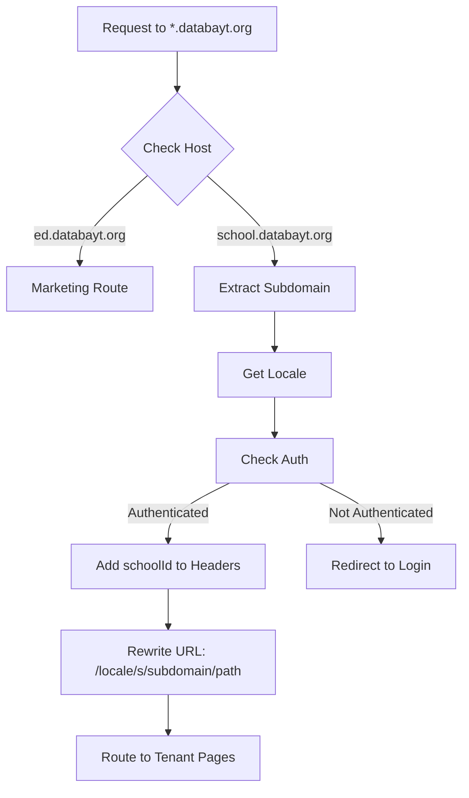

# Multi-Tenant Subdomain Architecture Documentation

## Project Overview

This document comprehensively traces the subdomain and multi-tenant architecture for DataBayt's Educational SaaS Platform. DataBayt (databayt.org) is a technology company that automates businesses across various sectors. This project specifically handles the education vertical as a multi-tenant SaaS platform.

## Domain Structure

### Primary Domain Hierarchy
```
databayt.org                      # Main company domain
├── ed.databayt.org              # Education SaaS marketing/landing page
├── school1.databayt.org         # Tenant school instance
├── school2.databayt.org         # Tenant school instance
└── [subdomain].databayt.org     # Dynamic tenant instances
```

### Special Case: ed.databayt.org
- **Purpose**: Marketing and platform landing page
- **Behavior**: Does NOT trigger tenant logic
- **Routing**: Uses `(marketing)` route group
- **Recognition**: Explicitly handled in middleware as special case

## Subdomain Detection Flow

### 1. Middleware Entry Point (`src/middleware.ts`)

The middleware is the gateway for all requests and handles subdomain detection with the following logic:

```typescript
// Line 171-194: Main domain detection
if (host === "ed.databayt.org" || host === "localhost:3000" || host === "localhost") {
  // Marketing routes with i18n
  // No subdomain rewriting - direct routing to marketing pages
}

// Line 199-203: Production subdomain detection
if (host.endsWith(".databayt.org") && !host.startsWith("ed.")) {
  subdomain = host.split(".")[0];
  // Tenant-specific routing
}
```

### 2. Subdomain Processing Steps

#### Step 1: Host Analysis
- Extract hostname from request headers
- Check against known patterns (production, development, Vercel preview)
- Special handling for `ed.databayt.org` (marketing domain)

#### Step 2: Locale Detection
- Check cookie for user preference (`NEXT_LOCALE`)
- Parse Accept-Language headers
- Default to `ar` (Arabic) if no preference found

#### Step 3: Route Rewriting
For tenant subdomains, the middleware rewrites URLs:
```
Original: school1.databayt.org/dashboard
Rewritten: /ar/s/school1/dashboard
```

This enables:
- Single codebase for all tenants
- Dynamic routing based on subdomain
- Proper locale support for each tenant

## Authentication & Multi-Tenancy

### Session Management (`src/auth.ts`)

#### Cookie Configuration
All authentication cookies are configured with domain-wide scope:
```typescript
domain: process.env.NODE_ENV === "production" ? '.databayt.org' : undefined
```

This enables:
- Single sign-on across subdomains
- Session sharing between marketing and tenant sites
- Seamless navigation between platform sections

#### JWT Token Extensions
The JWT token includes tenant-specific information:
```typescript
// auth.ts lines 126-135
token.id = user.id
token.role = user.role        // User role within tenant
token.schoolId = user.schoolId // Tenant identifier
```

### School ID Scoping

Every authenticated request includes `schoolId` in the session, ensuring:
- Data isolation between tenants
- Query scoping at the database level
- Proper authorization checks

## Database Multi-Tenancy

### Schema Design (`prisma/models/school.prisma`)

#### Core Tenant Model
```prisma
model School {
  id          String  @id @default(cuid())
  name        String
  domain      String  @unique  // Subdomain identifier
  // ... other fields
}
```

#### Tenant Scoping Pattern
All business models include mandatory `schoolId`:
```prisma
model Student {
  id       String @id
  schoolId String  // Required for ALL queries
  school   School @relation(...)
  // ... other fields
}
```

### Query Security
Every database operation MUST include schoolId:
```typescript
// Example from server actions
const session = await auth()
const schoolId = session?.user?.schoolId

await db.student.findMany({
  where: { schoolId }  // CRITICAL: Always scope by tenant
})
```

## Routing Architecture

### Directory Structure
```
src/app/
├── [lang]/                      # Internationalization
│   ├── (marketing)/             # Marketing pages (ed.databayt.org)
│   │   ├── page.tsx            # Landing page
│   │   ├── pricing/            # Pricing page
│   │   └── features/           # Features page
│   ├── (operator)/             # Platform admin pages
│   │   ├── tenants/            # Manage all schools
│   │   └── domains/            # Domain management
│   └── (platform)/             # Tenant-specific pages
│       ├── dashboard/          # School dashboard
│       ├── students/           # Student management
│       └── teachers/           # Teacher management
```

### Route Groups Explained

#### (marketing) - Public Pages
- **Domain**: ed.databayt.org
- **Purpose**: Platform marketing, pricing, features
- **Authentication**: Not required
- **SchoolId**: Not applicable

#### (operator) - Platform Admin
- **Access**: Platform administrators only
- **Purpose**: Manage all tenants, billing, domains
- **Authentication**: Required (isPlatformAdmin check)
- **SchoolId**: Can access all schools

#### (platform) - Tenant Pages
- **Domain**: [subdomain].databayt.org
- **Purpose**: School-specific operations
- **Authentication**: Required
- **SchoolId**: Scoped to specific tenant

## Subdomain Utility Functions (`src/lib/subdomain.ts`)

### extractSubdomain()
Handles subdomain extraction with special cases:
```typescript
// Special case for marketing domain
if (subdomain === 'ed') {
  return {
    subdomain: null,
    isSpecialCase: true,
    reason: 'ed.databayt.org - using marketing route'
  }
}
```

### generateSubdomain()
Intelligently creates subdomains from school names:
- Filters common educational terms
- Creates memorable, short subdomains
- Provides multiple suggestions
- Validates format and availability

## Environment-Specific Behavior

### Production (databayt.org)
- Full subdomain routing active
- SSL certificates for *.databayt.org
- Cookie domain: .databayt.org
- Example: `hogwarts.databayt.org`

### Development (localhost)
- Subdomain simulation available
- No cookie domain restriction
- Direct access via localhost:3000
- Subdomain testing: `school1.localhost:3000`

### Vercel Preview
- Special handling for preview deployments
- Pattern: `tenant---branch.vercel.app`
- Automatic subdomain extraction

## Security Considerations

### 1. Tenant Isolation
- **Database Level**: All queries include schoolId
- **Application Level**: Session validation on every request
- **URL Level**: Subdomain verification in middleware

### 2. Cross-Tenant Protection
- Users cannot access other tenant data
- schoolId mismatch results in 403 Forbidden
- Audit logs track all tenant access

### 3. Platform Admin Access
- Special role: DEVELOPER
- No schoolId restriction
- Can impersonate tenants for support
- All actions logged

## Onboarding Flow for New Schools

### 1. Initial Registration
- User signs up on ed.databayt.org
- Creates account with email/OAuth
- No schoolId assigned yet

### 2. School Setup
- User enters school information
- System generates subdomain suggestions
- Validates subdomain availability

### 3. Tenant Creation
```typescript
// Create new school record
const school = await db.school.create({
  data: {
    name: schoolName,
    domain: subdomain,  // e.g., "hogwarts"
    // ... other fields
  }
})

// Update user with schoolId
await db.user.update({
  where: { id: userId },
  data: {
    schoolId: school.id,
    role: 'ADMIN'  // School admin
  }
})
```

### 4. Subdomain Activation
- DNS records created (if automated)
- SSL certificate provisioned
- Redirect to: `[subdomain].databayt.org/onboarding`

## Technical Implementation Details

### Middleware Request Flow



### Server Action Pattern
All server actions follow this security pattern:
```typescript
"use server"

export async function createItem(data: FormData) {
  // 1. Get session and schoolId
  const session = await auth()
  const schoolId = session?.user?.schoolId

  // 2. Validate user has access to this tenant
  if (!schoolId) {
    throw new Error("Unauthorized: No school context")
  }

  // 3. Parse and validate data
  const validated = schema.parse(data)

  // 4. Execute with tenant scope
  await db.item.create({
    data: {
      ...validated,
      schoolId  // ALWAYS include schoolId
    }
  })

  // 5. Revalidate or redirect
  revalidatePath('/items')
}
```

## Monitoring & Debugging

### Request Tracking
Every request includes a unique requestId:
```typescript
const requestId = generateRequestId()
response.headers.set('x-request-id', requestId)
```

### Logging Context
All logs include:
- requestId: Unique request identifier
- schoolId: Current tenant context
- userId: Authenticated user
- subdomain: Detected subdomain
- pathname: Requested path

### Debug Endpoints
- `/api/debug/session` - View current session
- `/api/debug/tenant` - View tenant context
- `/api/debug/subdomain` - Test subdomain detection

## Common Issues & Solutions

### Issue 1: Subdomain Not Detected
**Symptom**: School pages show marketing content
**Solution**: Check middleware subdomain detection logic

### Issue 2: Cross-Tenant Data Leak
**Symptom**: User sees data from wrong school
**Solution**: Ensure ALL queries include schoolId

### Issue 3: Cookie Not Shared
**Symptom**: User logged out when switching subdomains
**Solution**: Verify cookie domain is `.databayt.org`

### Issue 4: Locale Reset on Subdomain
**Symptom**: Language preference not maintained
**Solution**: Check NEXT_LOCALE cookie configuration

## Future Enhancements

### Planned Features
1. **Custom Domains**: Allow schools to use their own domains
2. **Regional Clusters**: Deploy tenants to specific regions
3. **Tenant Templates**: Pre-configured school types
4. **White-Label Options**: Remove DataBayt branding

### Scalability Considerations
- Database sharding by schoolId
- CDN configuration per subdomain
- Tenant-specific caching strategies
- Automated subdomain provisioning

## Migration Plan: ed.databayt.org → me.databayt.org

### Overview
This section outlines the complete migration plan to change the marketing domain from `ed.databayt.org` (education) to `me.databayt.org` (Middle East), reflecting a potential regional focus or broader business scope.

### 1. Code Changes Required

#### 1.1 Middleware Updates (`src/middleware.ts`)

**Current Implementation (Line 171-194):**
```typescript
if (host === "ed.databayt.org" || host === "localhost:3000" || host === "localhost") {
  // Marketing routes with i18n
}
```

**Required Change:**
```typescript
if (host === "me.databayt.org" || host === "localhost:3000" || host === "localhost") {
  // Marketing routes with i18n
}
```

**Additional Update (Line 199-203):**
```typescript
// Current
if (host.endsWith(".databayt.org") && !host.startsWith("ed.")) {
  subdomain = host.split(".")[0];
}

// Change to
if (host.endsWith(".databayt.org") && !host.startsWith("me.")) {
  subdomain = host.split(".")[0];
}
```

#### 1.2 Subdomain Utility Updates (`src/lib/subdomain.ts`)

**Current Implementation (Line 33-40):**
```typescript
// Special case: ed.databayt.org should show marketing
if (subdomain === 'ed') {
  return {
    subdomain: null,
    isSpecialCase: true,
    reason: 'ed.databayt.org - using marketing route'
  }
}
```

**Required Change:**
```typescript
// Special case: me.databayt.org should show marketing
if (subdomain === 'me') {
  return {
    subdomain: null,
    isSpecialCase: true,
    reason: 'me.databayt.org - using marketing route'
  }
}
```

#### 1.3 Environment Variables Updates

**Files to Update:**
- `.env.local`
- `.env.production`
- `.env.example`

**Changes:**
```env
# Current
NEXT_PUBLIC_APP_URL=https://ed.databayt.org

# Change to
NEXT_PUBLIC_APP_URL=https://me.databayt.org
```

#### 1.4 OAuth Redirect URLs

**Update in OAuth Providers:**
- Google Console
- Facebook Developer Console

**Redirect URLs to Add:**
```
https://me.databayt.org/api/auth/callback/google
https://me.databayt.org/api/auth/callback/facebook
```

### 2. Infrastructure Changes

#### 2.1 DNS Configuration

**Add New DNS Records:**
```
Type: A Record
Name: me
Value: [Same IP as ed.databayt.org]

Type: CNAME (alternative)
Name: me
Value: [Same target as ed.databayt.org]
```

#### 2.2 SSL Certificate

**Options:**
1. **Wildcard Certificate**: If using `*.databayt.org`, no change needed
2. **Specific Certificate**: Request new certificate for `me.databayt.org`

**Vercel Configuration:**
- Add `me.databayt.org` to domain settings
- Verify domain ownership
- SSL auto-provisioned by Vercel

#### 2.3 CDN Configuration

If using Cloudflare or similar:
- Add `me.databayt.org` to allowed origins
- Configure caching rules identical to `ed.databayt.org`
- Set up page rules for the new subdomain

### 3. Migration Strategy

#### Phase 1: Parallel Operation (Recommended)
**Duration**: 2-4 weeks

1. **Deploy code supporting both subdomains:**
```typescript
if (host === "ed.databayt.org" || host === "me.databayt.org" || host === "localhost:3000") {
  // Marketing routes
}

if (host.endsWith(".databayt.org") && !host.startsWith("ed.") && !host.startsWith("me.")) {
  // Tenant logic
}
```

2. **Configure both domains to work simultaneously**
3. **Monitor traffic and functionality on both**

#### Phase 2: Soft Redirect
**Duration**: 2-4 weeks

1. **Add redirect notice on ed.databayt.org:**
```typescript
// In marketing layout or middleware
if (host === "ed.databayt.org") {
  // Show banner: "We're moving to me.databayt.org"
}
```

2. **Update all internal links to use me.databayt.org**
3. **Update documentation and communications**

#### Phase 3: Hard Redirect
**Duration**: Permanent

1. **Implement 301 redirect:**
```typescript
if (host === "ed.databayt.org") {
  return NextResponse.redirect(
    new URL(request.url.replace('ed.databayt.org', 'me.databayt.org')),
    301
  )
}
```

2. **Maintain redirect for SEO preservation**

### 4. Testing Checklist

#### Pre-Deployment Testing
- [ ] Local testing with hosts file modification
- [ ] Marketing pages load correctly on me.databayt.org
- [ ] Tenant subdomains still work (school.databayt.org)
- [ ] Authentication flow works on new domain
- [ ] OAuth callbacks function properly
- [ ] Cookie domain settings work across subdomains

#### Post-Deployment Verification
- [ ] SSL certificate valid for me.databayt.org
- [ ] All marketing routes accessible
- [ ] No conflicts with existing subdomains
- [ ] Analytics tracking updated
- [ ] Search console domain verification
- [ ] Email links updated

### 5. Rollback Plan

#### Quick Rollback Strategy
If issues arise, revert by:

1. **Code Reversion:**
```typescript
// Revert middleware to only recognize ed.databayt.org
if (host === "ed.databayt.org" || host === "localhost:3000") {
  // Original logic
}
```

2. **DNS Fallback:**
- Keep ed.databayt.org DNS records active
- Remove me.databayt.org if needed

3. **Environment Variable Reversion:**
- Switch back NEXT_PUBLIC_APP_URL to ed.databayt.org

### 6. SEO & Marketing Considerations

#### SEO Impact Mitigation
1. **301 Redirects**: Preserve link equity
2. **Update Sitemap**: Submit new sitemap to search engines
3. **Canonical URLs**: Update all canonical tags
4. **Search Console**: Add me.databayt.org as new property

#### Marketing Materials Update
- [ ] Update all printed materials
- [ ] Update social media profiles
- [ ] Update email templates
- [ ] Update business cards
- [ ] Update presentations

### 7. Monitoring & Success Metrics

#### Key Metrics to Track
- **Traffic Migration**: % of traffic on new vs old domain
- **SEO Rankings**: Monitor keyword positions
- **Error Rates**: 404s, failed auth attempts
- **User Feedback**: Support tickets about domain change

#### Monitoring Tools Setup
```javascript
// Add to analytics
if (window.location.hostname === 'me.databayt.org') {
  analytics.track('new_domain_visit', {
    referrer: document.referrer,
    timestamp: new Date().toISOString()
  })
}
```

### 8. Timeline Estimate

| Phase | Duration | Tasks |
|-------|----------|-------|
| Preparation | 1 week | Code changes, testing, infrastructure setup |
| Parallel Operation | 2-4 weeks | Both domains active, monitoring |
| Soft Migration | 2-4 weeks | User communication, gradual transition |
| Hard Migration | 1 day | Deploy redirects, finalize switch |
| Post-Migration | 2 weeks | Monitor, optimize, fix issues |

**Total Timeline**: 7-11 weeks for complete migration

### 9. Risk Assessment

| Risk | Likelihood | Impact | Mitigation |
|------|------------|--------|------------|
| SEO Traffic Loss | Medium | High | 301 redirects, sitemap updates |
| User Confusion | Medium | Medium | Clear communication, transition period |
| OAuth Failures | Low | High | Test thoroughly, maintain both configs |
| SSL Issues | Low | High | Pre-provision certificates |
| Subdomain Conflicts | Low | Medium | Careful testing, validation |

### 10. Implementation Code Snippets

#### Complete Middleware Update
```typescript
// src/middleware.ts
export async function middleware(req: NextRequest) {
  const host = req.headers.get("host") || "";

  // Support both during transition
  const isMarketingDomain = host === "me.databayt.org" ||
                           host === "ed.databayt.org" || // Remove after migration
                           host === "localhost:3000";

  if (isMarketingDomain) {
    // Handle redirect if needed
    if (host === "ed.databayt.org" && process.env.REDIRECT_OLD_DOMAIN === 'true') {
      const newUrl = new URL(req.url);
      newUrl.host = "me.databayt.org";
      return NextResponse.redirect(newUrl, 301);
    }

    // Marketing route logic
    // ... existing marketing logic
  }

  // Tenant subdomain detection
  if (host.endsWith(".databayt.org") &&
      !host.startsWith("me.") &&
      !host.startsWith("ed.")) { // Can remove ed check after migration
    // ... tenant logic
  }
}
```

#### Environment Variable Configuration
```typescript
// config/domains.ts
export const MARKETING_DOMAINS = [
  process.env.NEXT_PUBLIC_MARKETING_DOMAIN || 'me.databayt.org',
  'localhost:3000',
  'localhost'
];

export const isMarketingDomain = (host: string): boolean => {
  return MARKETING_DOMAINS.includes(host);
};
```

This migration plan ensures a smooth transition from ed.databayt.org to me.databayt.org with minimal disruption to users and SEO rankings.

## Conclusion

This multi-tenant architecture provides:
- **Complete tenant isolation** through schoolId scoping
- **Flexible subdomain routing** via middleware rewriting
- **Unified codebase** for all tenants
- **Secure authentication** across subdomains
- **Scalable infrastructure** for growth

The system elegantly handles the distinction between the marketing domain (currently ed.databayt.org, migrating to me.databayt.org) and tenant subdomains ([school].databayt.org) while maintaining security, performance, and user experience across the platform.